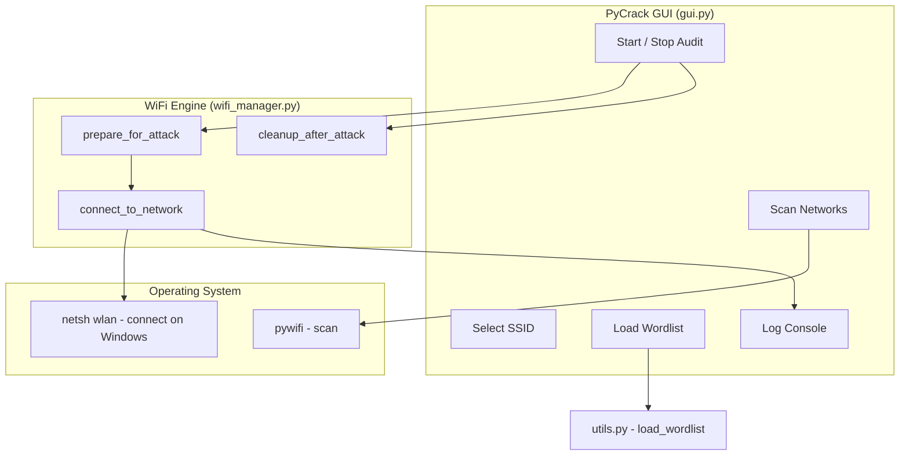

# PyCrack — WiFi Auditing Tool 🔐


> **Built as part of my Certified Ethical Hacker (CEH) coursework.** PyCrack is an educational WiFi auditing tool that demonstrates how dictionary-based WPA2-PSK authentication testing works — for study, authorized lab environments, and penetration testing on networks you own or have explicit written permission to test.

---

## ⚠️ Legal Disclaimer

**Educational use only.** This software is provided strictly for academic study, authorized security research, and lawful penetration testing in controlled environments (e.g. university labs and networks you own or have explicit written permission to test).

Unauthorized use is illegal. Gaining access to WiFi infrastructure without consent may violate computer misuse, telecommunications, and privacy laws in your jurisdiction. **If you do not have clear, documented authorization to test a network, do not use this tool.**

By using, copying, or distributing this software, you acknowledge that you do so at your own risk and for lawful purposes only. The author expressly disclaims all liability for any direct, indirect, or consequential damages arising from misuse. **Any unauthorized use is solely the fault of the end user.**

---

## Why I Built This

During my CEH preparation, I wanted to go beyond theory and understand how WPA2-PSK dictionary attacks actually work at the OS level — not just conceptually, but mechanically. Most tools in this space are black boxes. PyCrack is a transparent, readable implementation that shows every step: network discovery, profile management, connection attempts, verification, and cleanup. Building it taught me more about Windows wireless internals and attack surface than any textbook did.

---

## Features

- Scan nearby WiFi networks and list unique SSIDs with signal strength
- Load any `.txt` wordlist (one password per line)
- Attempt WPA2-PSK authentication using each candidate password
- Double-verification step to eliminate false positives
- Profile backup and restore — your saved passwords are preserved after auditing
- Simple GUI with live logging and start/stop controls
- Background threading — UI stays responsive during audits

---

## Requirements

- Python 3.x
- Windows (recommended — uses `netsh wlan` for reliable connection verification)
- A WiFi adapter supported by your OS
- `customtkinter`, `pywifi`

---

## Install

```bash
pip install customtkinter pywifi
```

Or if you have a `requirements.txt`:

```bash
pip install -r requirements.txt
```

---

## Run

```bash
python main.py
```

---

## How to Use

1. Click **Scan Networks** to discover nearby SSIDs.
2. Select a target network from the list.
3. Click **Load Wordlist** and choose a `.txt` file with one password per line.
4. Click **Start Audit**.
5. Monitor progress in the log console.
6. Click **Stop Audit** at any time to abort.

---

## How It Works

PyCrack performs a **dictionary attack** against a **WPA2-Personal (WPA2-PSK)** network. It does not crack WiFi handshakes offline — instead, it tests each password by attempting a real authenticated connection and verifying via OS state.

### Attack Model

| Aspect | Detail |
|---|---|
| Attack type | Online dictionary / wordlist via live connection attempts |
| Target | One user-selected SSID |
| Password source | User-loaded `.txt` wordlist |
| Success criteria | OS confirms a live authenticated connection to the target SSID |
| Encryption assumed | WPA2-Personal (PSK) with AES |

---

### Architecture



---

### Project Structure

| File | Role |
|---|---|
| `main.py` | Application entry point |
| `PyCrack/gui.py` | CustomTkinter UI, audit loop, logging |
| `PyCrack/wifi_manager.py` | Network scan, connect/disconnect, profile handling |
| `PyCrack/utils.py` | Logger setup and wordlist loading |

---

### Step-by-Step Flow

#### 1. Network Discovery
- `WifiManager.scan_networks()` triggers a wireless scan via `pywifi`.
- Duplicate SSIDs are removed; each network is shown with signal strength.

#### 2. Wordlist Loading
- Any `.txt` file is accepted — one password per line.
- `load_wordlist()` reads, strips whitespace, and skips empty lines.

#### 3. Audit Preparation
Before the first attempt, the tool sets up a clean environment:

1. Disconnect from the current network.
2. Back up the saved Windows profile for the target SSID (if one exists).
3. Delete the saved profile so Windows cannot auto-reconnect mid-audit (which would cause false positives).
4. Remove any leftover temporary profile from a previous run.

#### 4. Password Attempts
For each candidate password:

1. Log `Trying password: <candidate>`.
2. Call `connect_to_network(ssid, password)`.
3. On success, log the found password and stop.
4. On user stop, exit early.
5. If the wordlist is exhausted, log that the password was not found.

The audit loop runs on a **background thread** so the GUI stays responsive.

#### 5. Connection Attempt (Windows)
Each password is tested through `netsh wlan`:

1. Disconnect and wait until the adapter is idle.
2. Build a temporary WiFi profile (`PyCrackAttack`) as XML — WPA2-Personal / AES / manual connection mode.
3. Add the profile with `netsh wlan add profile`.
4. Connect with `netsh wlan connect`.
5. Poll `netsh wlan show interfaces` for up to 15 seconds — checking `State: connected` and correct SSID match.
6. Verify by disconnecting and reconnecting with the same profile (reduces false positives from stale connections).
7. On failure, disconnect and move to the next password.

On non-Windows systems, falls back to `pywifi` connect/status checks.

#### 6. Cleanup
When the audit ends (success, failure, or user stop):

- The temporary `PyCrackAttack` profile is deleted.
- **If password found:** a correctly named profile is created so you stay connected.
- **If not found / stopped early:** your original saved profile is restored from the backup.

---

### What Counts as Success?

A password is marked successful only when:

1. `connect_to_network()` returns `True`.
2. On Windows, the OS connected to the **correct SSID twice in a row** using the candidate profile.
3. The GUI logs: `SUCCESS! Password found: <password>`.

There is no hardcoded answer, no comparison against a known value — only live OS confirmation.

---

### Timing & Performance

- Each attempt takes roughly **15–30 seconds** on Windows (disconnect → connect → verify → timeout).
- A 20-password wordlist may take several minutes to complete.
- Speed depends on adapter, router response time, signal strength, and OS behavior.

---

## Limitations

- **WPA2-Personal only** — not designed for WPA3, enterprise (802.1X), or open networks.
- **Online attack** — requires the network to be in range; no offline handshake cracking.
- **Wordlist dependent** — if the real password is not in your list, the audit cannot succeed.
- **Windows recommended** — most reliable due to `netsh` integration; other OS support via `pywifi` fallback.
- **No packet capture** — does not perform traffic interception or offline analysis (unlike Aircrack-ng).

---

## License

This project is licensed under the MIT License — see the [LICENSE](LICENSE) file for details.